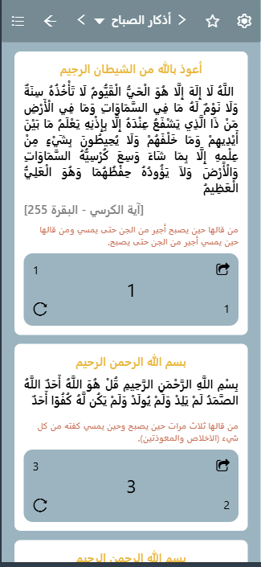
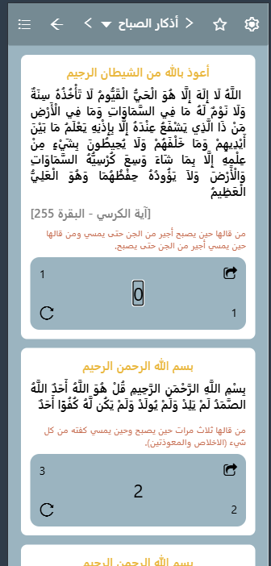

# Athkar Morning App (React Native / Expo)

A clean Islamic morning adhkar (remembrance) app built with React Native and Expo. Displays Quran verses and duas with a built-in countdown counter for each dhikr.

---

## Screenshots




---

## Features

- Full list of morning adhkar (أذكار الصباح) with Arabic text
- Each card shows the dhikr text, source name, and its virtue (فضل)
- Built-in countdown counter — tap to count down, reset anytime
- Opening phrase displayed in gold (بسم الله / أعوذ بالله)
- Virtue text highlighted in a distinct color
- Scrollable card list with a styled top navigation bar
- Lightweight — no backend, no API, all content is local

---

## Project Structure

```
├── App.js        # Main app — Card component + all adhkar content + styles
├── index.js      # Expo entry point (registerRootComponent)
```

---

## Getting Started

### Prerequisites

- [Node.js](https://nodejs.org/) (v18 or higher)
- [Expo CLI](https://docs.expo.dev/get-started/installation/)
- Expo Go app on your phone, or an Android/iOS emulator

### Installation

1. **Clone the repository**

   ```bash
   git clone https://github.com/your-username/athkar-app.git
   cd athkar-app
   ```

2. **Install dependencies**

   ```bash
   npm install
   ```

3. **Install required icon packages**

   ```bash
   npx expo install @expo/vector-icons
   ```

4. **Start the app**

   ```bash
   npx expo start
   ```

   Scan the QR code with Expo Go, or press `a` for Android / `i` for iOS.

---

## How It Works

### `Card` Component

A stateful component that receives the dhikr data as props (`begin`, `surah`, `name`, `note`, `count`, `number`). Uses `useState` to manage the local counter — tapping the number decrements it, and the reload icon resets it to the original count.

### `App` Component

Holds the full list of adhkar as an array of objects and renders a `Card` for each one inside a `ScrollView`. The top navigation bar mimics a real app header with navigation and settings icons.

### Counter Logic

Each card has its own independent counter initialized from the `count` prop. Pressing the counter decrements it (stops at 0). The reset button restores it to the original value.

---

## Dependencies

| Package              | Purpose                       |
| -------------------- | ----------------------------- |
| `expo`               | Development toolchain         |
| `react-native`       | Core mobile framework         |
| `@expo/vector-icons` | AntDesign + FontAwesome icons |

---

## Possible Improvements

- Add evening adhkar (أذكار المساء) with a toggle
- Save progress using AsyncStorage
- Add sound on each count tap
- Dark mode support

---

## Author

**Maysam Bradiya**  
Junior Frontend & Mobile Developer  
[GitHub](https://github.com/your-username) · [LinkedIn](https://linkedin.com/in/your-profile)

---

## License

This project is open source and available under the [MIT License](LICENSE).
